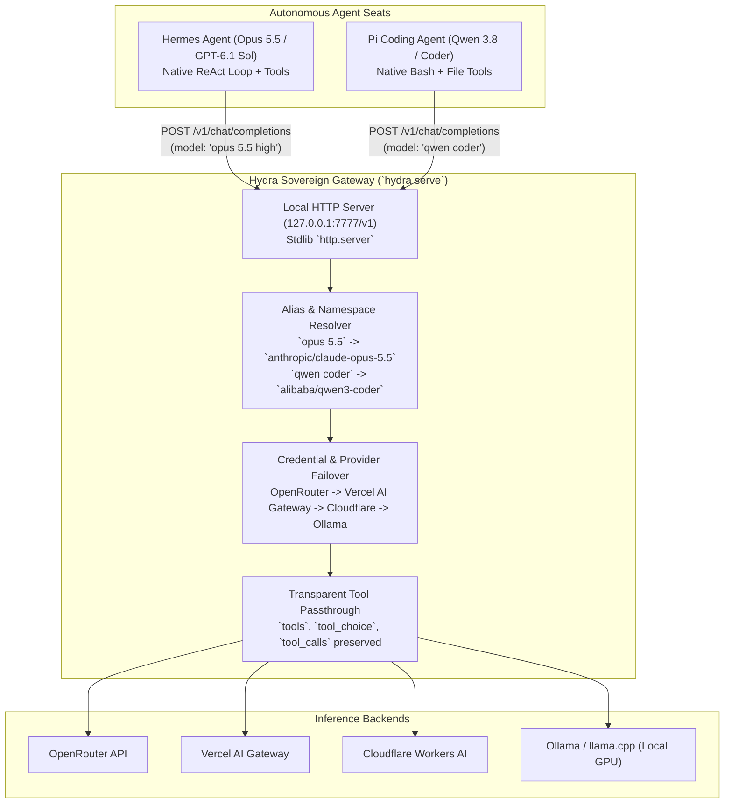
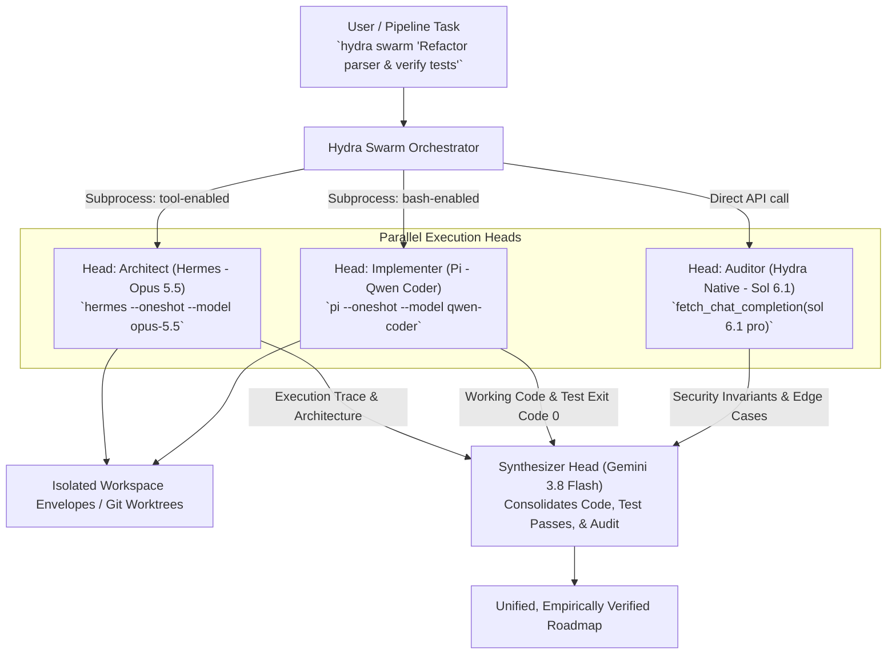
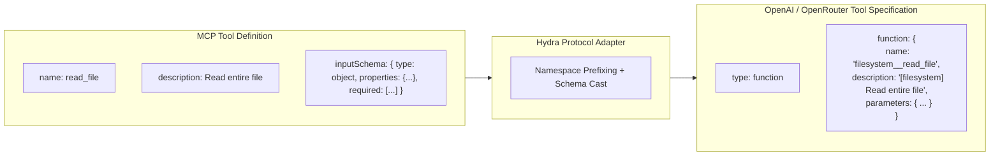
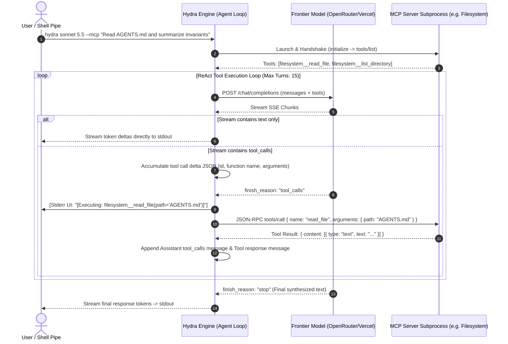
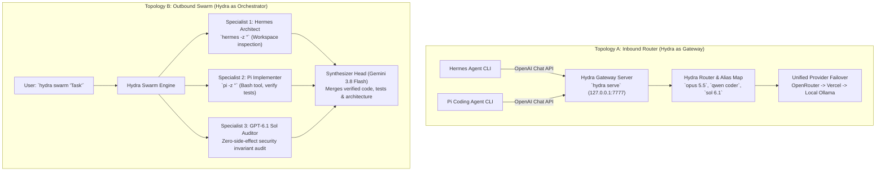
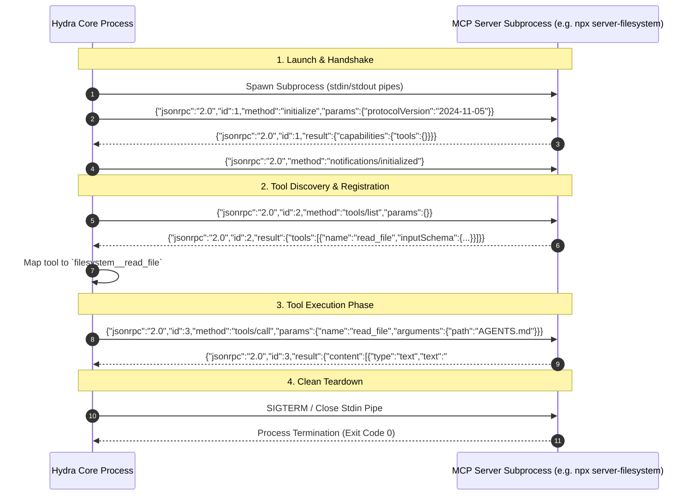

# Hydra Tools & MCP Architecture Specification

**Status**: Canon Specification  
**Version**: 2.0.0-draft  
**Target Systems**: Hydra CLI (`hydra-ai-cli` / `hydra-agent-cli`), Hermes Agent, Pi Coding Agent, Public MCP Servers  
**Runtime Invariant**: Zero third-party package dependencies (Standard library only: Python `urllib`, `subprocess`, `threading`, `json` / Node `http`, `child_process`, `fs`)  

---

## 1. Executive Summary & Problem Formulation

Hydra 1.1.0 is a sovereign multi-headed AI shell utility engineered around a **zero-dependency prompt-and-pipe model**. It provides instantaneous, unified routing to frontier cloud models (OpenRouter, Vercel AI Gateway), free-tier models (Cloudflare Workers AI, OpenRouter free models), local inference engines (Ollama, llama.cpp, EasyLM), and multi-agent textual swarms (`architect`, `coder`, `auditor` -> `synthesizer`).

However, as autonomous workflows evolve across the sovereign documents workspace:
1. **Raw Completion vs. Action Loops**: Hydra currently operates purely as a completion pipe (one prompt in -> one response out). It has no internal mechanism to execute tools, manage multi-turn tool-call conversations, or ground responses in external environments.
2. **Subordinate / Peer Agents (Hermes & Pi)**: In `AGENTS.md`, `role pi` is designated as the default terminal coding agent (Qwen 3.8 / Qwen3 Coder with tool use and bash execution), and `role hermes` is designated as the frontier loop for Opus 5.5 and GPT-6.1 Sol. There is currently no formal bridge connecting Hydra's sovereign routing layer with Hermes or Pi.
3. **Public MCP Integration**: The Model Context Protocol (MCP) has emerged as the universal standard for tool exposure (SQLite, Filesystem, GitHub, Brave Search, Fetch, Git). Hydra currently possesses no MCP client transport, tool schema converter, or tool execution dispatch loop.

This specification provides the production-grade architectural blueprint to resolve all three challenges while strictly preserving Hydra's core invariants: **zero external dependencies**, **dual-runtime parity** (Python 3.8+ and Node 18+), **posix/windows compatibility**, and **sovereign execution**.

---

## 2. Current Architecture Audit: How Tools are Handled in Hydra Today

### 2.1 The Prompt-and-Pipe Pipeline
Hydra 1.1.0's request flow is strictly unidirectional and stateless:

```
[Stdin Pipe / CLI Args]
          │
          ▼
 [router.py / cli.py] ────────► consume_alias() ──► resolve_route()
          │
          ▼
   _build_payload()
   {
     "model": "...",
     "messages": [
       {"role": "system", "content": "..."},
       {"role": "user", "content": "..."}
     ],
     "stream": true,
     "temperature": ...
   }
          │
          ▼
[providers.py: urllib.request] ──► [OpenRouter / Vercel / Cloudflare / Ollama]
          │
          ▼
 [stream_chat_completion] ────► SSE Chunks (data: {"choices":[{"delta":{"content":"..."}}]})
          │
          ▼
   [stdout (flush)]
```

### 2.2 Existing Tool Capabilities
- **Within Hydra**: **Zero tool execution capabilities exist.**
  - `_build_payload()` in `hydra_cli/providers.py` only accepts `model`, `messages`, `stream`, `temperature`, `max_tokens`, and `reasoning`. It has no `tools` or `tool_choice` parameter.
  - `stream_chat_completion()` and `fetch_chat_completion()` only extract `delta.content` or `message.content`. If an upstream model returns `tool_calls`, Hydra either ignores the chunk or raises an error on empty completion.
- **Outside Hydra (Hydra as a Tool)**:
  - Hydra is currently architected to be called *by* other agent loops (LangChain, AutoGen, CrewAI, Antigravity, shell scripts) as an atomic command-line tool via `hydra <alias> "<prompt>" --no-stream` or `complete(alias, prompt)`.

### 2.3 Structural Contrast: Raw Completion vs. Tool-Augmented Agent Loops

| Architectural Dimension | Hydra 1.1 (Raw Completion Model) | Tool-Augmented Agent Loop (Hermes / Pi / ReAct) |
| :--- | :--- | :--- |
| **State Lifespan** | Ephemeral, single request/response turn. | Stateful multi-turn conversation graph. |
| **Payload Schema** | `messages: [system, user]` only. | `messages` + `tools: [function_definitions]` + `tool_choice`. |
| **Response Parsing** | Reads text tokens only (`content`). | Dispatches on `finish_reason`: `stop` (emit text) vs. `tool_calls` (execute). |
| **Execution Engine** | None; pure network I/O. | Local sandbox / subprocess / network executor for tool calls. |
| **Message Topology** | 1 prompt -> 1 completion -> process exit 0. | Prompt -> LLM `tool_calls` -> Tool result (`role: tool`) -> Next LLM turn -> Repeat until `stop`. |
| **Error Handling** | Provider HTTP retry/fallback before first token. | Tool runtime error feedback injected into conversation for self-healing. |

---

## 3. Connecting Hermes and Pi into the Loop

In `AGENTS.md`:
- `role pi`: *Default autonomous terminal coding agent powered by Qwen 3.8 / Qwen3 Coder with tool use and bash execution.*
- `role hermes`: *Frontier loop for Opus 5.5 and GPT-6.1 Sol.*

Connecting Hermes and Pi to Hydra requires two distinct, complementary architectural topologies:

### 3.1 Topology A: Hydra as the Model Router / Gateway Backend (Inbound)

In this mode, **Hydra acts as the local sovereign API Gateway** for Pi and Hermes. Pi and Hermes retain their sophisticated internal tool loops, file operations, and bash environments, but point their LLM inference requests to Hydra instead of hardcoded third-party endpoints.



#### Why Topology A is Essential:
1. **Unified Credential & Billing Management**: Hermes and Pi do not need separate API keys or billing configurations. All keys live once in `~/.hydra/.env`.
2. **Dynamic Gateway Failover**: If OpenRouter experiences an outage or rate limit on Opus 5.5, Hydra automatically fails over to Vercel AI Gateway without interrupting Hermes's multi-step plan.
3. **Local/Cloud Hybrid Economics**: Pi can be requested with `hydra local` or `qwen3.5:4b-128k` on local Ollama, or escalated to cloud OpenRouter Qwen 3.8 via Hydra routing rules.
4. **Transparent Tool Passthrough**: The proxy passes `tools` in the request and `tool_calls` in the response stream without needing to execute them itself; Hermes and Pi execute the tools locally.

### 3.2 Topology B: Hydra as the Swarm Master Invoking Hermes / Pi as Subordinates (Outbound)

In this mode, **Hydra's Swarm fans out tasks to Hermes and Pi as full execution engines** rather than text-only completion heads.



#### Head Specialization:
- **`architect` (Hermes)**: Runs `hermes --oneshot "<task>"` with file inspection tools enabled. It can read actual repository files and verify system invariants before outputting architectural specs.
- **`coder` (Pi)**: Runs `pi --oneshot "<task>"` with bash tool enabled. It applies changes, runs `pytest` or `cargo test`, and guarantees exit code zero.
- **`auditor` (Native Hydra)**: High-reasoning zero-side-effect static code auditor (GPT-6.1 Sol Pro).
- **`synthesizer` (Gemini 3.8 Flash)**: Consolidates execution traces, test proofs, and audit critiques into the final roadmap.

---

## 4. Public MCP Server Integration Blueprint

The **Model Context Protocol (MCP)** standardizes how language models connect to external tools (SQLite, GitHub, Filesystem, Brave Search, Fetch, PostgreSQL). To integrate MCP into Hydra without violating the **zero external dependency** constraint, Hydra must implement a native JSON-RPC 2.0 transport client using standard libraries.

### 4.1 MCP Transport Layer (Stdlib-Powered)

MCP operates over two primary transport protocols:
1. **Stdio Subprocess Transport**:
   - Launches a local server via child process (e.g. `npx -y @modelcontextprotocol/server-filesystem <dir>` or `uvx mcp-server-sqlite --db-path <db>`).
   - Communication: Newline-delimited JSON-RPC 2.0 messages over standard `stdin` and `stdout`.
   - Windows compatibility: Command normalization (`cmd.exe /c` wrapper for `npx`/`uvx` if needed), `stdin.flush()`, non-blocking reader thread for `stderr` to prevent buffer deadlocks.
2. **SSE / Streamable HTTP Transport**:
   - Connects to remote or enterprise MCP servers via HTTP.
   - Initial GET request initiates SSE channel; server emits `endpoint` event containing the POST URI.
   - Subsequent client JSON-RPC calls are standard HTTP POST requests; responses arrive over the SSE stream or as direct JSON.

### 4.2 Configuration Architecture (`~/.hydra/mcp_servers.json`)

Hydra reads MCP configurations with standard precedence:
1. Active CLI arguments: `--mcp-server <name>`
2. Project workspace config: `./.hydra/mcp_servers.json` or `./.mcp.json`
3. User global config: `~/.hydra/mcp_servers.json`

#### Concrete Schema:
```json
{
  "$schema": "https://hydra.sovereign/schemas/mcp-v1.json",
  "mcpServers": {
    "filesystem": {
      "command": "npx",
      "args": ["-y", "@modelcontextprotocol/server-filesystem", "C:\\Users\\jpm05\\documents"],
      "env": {}
    },
    "sqlite": {
      "command": "uvx",
      "args": ["mcp-server-sqlite", "--db-path", "./workspace.db"]
    },
    "fetch": {
      "command": "uvx",
      "args": ["mcp-server-fetch"]
    },
    "github": {
      "command": "npx",
      "args": ["-y", "@modelcontextprotocol/server-github"],
      "env": {
        "GITHUB_PERSONAL_ACCESS_TOKEN": "${GITHUB_TOKEN}"
      }
    },
    "brave-search": {
      "url": "https://api.search.brave.com/mcp/sse",
      "headers": {
        "Authorization": "Bearer ${BRAVE_API_KEY}"
      }
    }
  }
}
```

*Variable Interpolation*: Environment variables `${VAR_NAME}` are expanded from `os.environ` and `~/.hydra/.env`.

### 4.3 Tool Discovery, Namespacing, and Schema Translation

When Hydra launches with MCP enabled:
1. **Initialize Phase**: Sends `initialize` JSON-RPC handshake, receives server info and capabilities, emits `notifications/initialized`.
2. **List Phase**: Sends `tools/list`, receives array of tool definitions.
3. **Namespacing**: To prevent collisions between multiple servers providing tools with identical names (e.g. `read_file`), tools are namespaced:
   $$\text{qualified\_name} = \langle\text{server\_name}\rangle\text{\_\_}\langle\text{tool\_name}\rangle$$
   *Example*: `filesystem__read_file`, `github__create_pull_request`.
4. **OpenAI Schema Translation**:
   Hydra translates MCP JSON schemas directly into OpenAI function-calling formats expected by OpenRouter, Vercel, and Ollama.



### 4.4 The ReAct Execution Loop & Streaming State Machine

When tools are wired into Hydra, the generation engine upgrades from a single pass to a **bounded iterative state machine**:



---

## 5. Concrete Interface Definitions & Code Blueprints

### 5.1 Native Zero-Dependency Stdio MCP Client (`hydra_cli/mcp.py`)

```python
"""
Zero-dependency Model Context Protocol (MCP) client for Hydra CLI.
Implements JSON-RPC 2.0 over standard I/O subprocess transport.
"""

import json
import os
import subprocess
import sys
import threading
from typing import Any, Dict, List, Optional, Tuple


class McpSubprocessClient:
    """Manages an active stdio connection to an external MCP server."""

    def __init__(self, name: str, command: str, args: List[str], env: Optional[Dict[str, str]] = None):
        self.name = name
        self.command = command
        self.args = args
        self.env = {**os.environ, **(env or {})}
        self.process: Optional[subprocess.Popen] = None
        self._msg_id = 0
        self._lock = threading.Lock()

    def start(self) -> None:
        """Launch the server subprocess."""
        cmd = [self.command] + self.args
        # On Windows, resolve npx/uvx via shell if executable not found directly
        shell = sys.platform == "win32" and not (self.command.endswith(".exe") or self.command.endswith(".cmd"))
        self.process = subprocess.Popen(
            cmd,
            stdin=subprocess.PIPE,
            stdout=subprocess.PIPE,
            stderr=subprocess.PIPE,
            text=True,
            encoding="utf-8",
            shell=shell,
            env=self.env,
            bufsize=1,
        )
        # Drain stderr in daemon thread to prevent pipe deadlocks
        def _drain_stderr():
            while self.process and self.process.poll() is None:
                line = self.process.stderr.readline()
                if not line:
                    break

        threading.Thread(target=_drain_stderr, daemon=True).start()
        self._initialize()

    def _send_rpc(self, method: str, params: Optional[Dict[str, Any]] = None) -> Dict[str, Any]:
        """Send a synchronous JSON-RPC request and wait for the response."""
        with self._lock:
            self._msg_id += 1
            req_id = self._msg_id
            payload = {
                "jsonrpc": "2.0",
                "id": req_id,
                "method": method,
                "params": params or {},
            }
            if not self.process or not self.process.stdin or not self.process.stdout:
                raise RuntimeError(f"MCP server '{self.name}' is not running.")

            raw_req = json.dumps(payload) + "\n"
            self.process.stdin.write(raw_req)
            self.process.stdin.flush()

            while True:
                line = self.process.stdout.readline()
                if not line:
                    raise EOFError(f"MCP server '{self.name}' closed stdout prematurely.")
                line = line.strip()
                if not line:
                    continue
                try:
                    res = json.loads(line)
                    if res.get("id") == req_id:
                        if "error" in res:
                            raise RuntimeError(f"MCP error from {self.name}: {res['error']}")
                        return res.get("result", {})
                except json.JSONDecodeError:
                    continue

    def _initialize(self) -> None:
        """Execute MCP initialization handshake."""
        self._send_rpc("initialize", {
            "protocolVersion": "2024-11-05",
            "capabilities": {},
            "clientInfo": {"name": "hydra", "version": "2.0.0"},
        })
        # Send initialized notification
        if self.process and self.process.stdin:
            notif = json.dumps({"jsonrpc": "2.0", "method": "notifications/initialized"}) + "\n"
            self.process.stdin.write(notif)
            self.process.stdin.flush()

    def list_tools(self) -> List[Dict[str, Any]]:
        """Fetch registered tools from MCP server."""
        res = self._send_rpc("tools/list")
        return res.get("tools", [])

    def call_tool(self, tool_name: str, arguments: Dict[str, Any]) -> str:
        """Call a specific tool on the server and return text result."""
        res = self._send_rpc("tools/call", {
            "name": tool_name,
            "arguments": arguments,
        })
        contents = res.get("content", [])
        text_parts = [c.get("text", "") for c in contents if c.get("type") == "text"]
        return "\n".join(text_parts) if text_parts else json.dumps(res)

    def close(self) -> None:
        """Terminate the server process."""
        if self.process:
            try:
                self.process.terminate()
                self.process.wait(timeout=2.0)
            except Exception:
                self.process.kill()
```

### 5.2 MCP Registry & Schema Adapter (`hydra_cli/mcp_registry.py`)

```python
"""
Registry managing multiple MCP servers, tool namespacing, and schema mapping.
"""

import json
import os
from typing import Any, Dict, List, Optional
from hydra_cli.mcp import McpSubprocessClient


class McpRegistry:
    def __init__(self):
        self.clients: Dict[str, McpSubprocessClient] = {}
        self.tools_map: Dict[str, Tuple[str, str]] = {}  # qualified_name -> (server_name, original_name)

    def load_config(self, config_path: Optional[str] = None) -> None:
        """Load and start servers defined in mcp_servers.json."""
        path = config_path or os.path.expanduser("~/.hydra/mcp_servers.json")
        if not os.path.exists(path):
            return

        with open(path, "r", encoding="utf-8") as f:
            data = json.load(f)

        servers = data.get("mcpServers", {})
        for name, spec in servers.items():
            command = spec.get("command")
            args = spec.get("args", [])
            env = spec.get("env", {})
            if command:
                client = McpSubprocessClient(name, command, args, env)
                try:
                    client.start()
                    self.clients[name] = client
                    for tool in client.list_tools():
                        orig_name = tool["name"]
                        qual_name = f"{name}__{orig_name}"
                        self.tools_map[qual_name] = (name, orig_name)
                except Exception as e:
                    sys.stderr.write(f"[WARN] Failed to start MCP server '{name}': {e}\n")

    def get_openai_tools(self) -> List[Dict[str, Any]]:
        """Export all registered MCP tools as OpenAI function call schemas."""
        tools = []
        for qual_name, (server_name, orig_name) in self.tools_map.items():
            client = self.clients[server_name]
            raw_tools = client.list_tools()
            for rt in raw_tools:
                if rt["name"] == orig_name:
                    tools.append({
                        "type": "function",
                        "function": {
                            "name": qual_name,
                            "description": f"[{server_name}] {rt.get('description', '')}",
                            "parameters": rt.get("inputSchema", {"type": "object", "properties": {}}),
                        },
                    })
        return tools

    def dispatch(self, qualified_tool_name: str, arguments: Dict[str, Any]) -> str:
        """Route tool invocation to the correct MCP client."""
        if qualified_tool_name not in self.tools_map:
            raise ValueError(f"Unknown MCP tool: {qualified_tool_name}")
        server_name, orig_name = self.tools_map[qualified_tool_name]
        client = self.clients[server_name]
        return client.call_tool(orig_name, arguments)

    def shutdown(self) -> None:
        """Stop all running MCP servers."""
        for client in self.clients.values():
            client.close()
```

### 5.3 The ReAct Loop Engine (`hydra_cli/agent.py`)

```python
"""
Autonomous agent execution loop with MCP tool calling and multi-turn state.
"""

import json
import sys
from typing import Any, Dict, List, Optional
from hydra_cli.config import resolve_route
from hydra_cli.mcp_registry import McpRegistry
from hydra_cli.providers import fetch_chat_completion, get_frontier_providers, reasoning_fields


def run_agent_loop(
    alias: str,
    prompt: str,
    system_prompt: str,
    registry: McpRegistry,
    max_turns: int = 15,
) -> str:
    """Execute autonomous agent loop until completion or max turns."""
    route = resolve_route(alias)
    model_id = route["model"]
    providers = get_frontier_providers()
    if not providers:
        raise RuntimeError("No frontier credentials found.")
    provider = providers[0]

    messages: List[Dict[str, Any]] = [
        {"role": "system", "content": system_prompt},
        {"role": "user", "content": prompt},
    ]

    tools = registry.get_openai_tools()
    reasoning = reasoning_fields(route.get("effort"), route.get("reasoning_mode"))

    for turn in range(max_turns):
        payload = {
            "model": model_id,
            "messages": messages,
            "stream": False,
        }
        if tools:
            payload["tools"] = tools
            payload["tool_choice"] = "auto"
        if reasoning:
            payload["reasoning"] = reasoning

        # Perform HTTP POST using providers.py transport
        res_json = _fetch_raw_completion(provider["url"], provider["headers"], payload)
        choice = res_json["choices"][0]
        message = choice["message"]
        messages.append(message)

        tool_calls = message.get("tool_calls")
        if not tool_calls:
            # Model emitted final response
            final_content = message.get("content", "")
            return final_content

        # Handle tool execution
        for tc in tool_calls:
            call_id = tc["id"]
            fn = tc["function"]
            fn_name = fn["name"]
            try:
                args = json.loads(fn.get("arguments", "{}"))
            except Exception:
                args = {}

            sys.stderr.write(f"\n[HYDRA TOOL] Invoking {fn_name}({args})...\n")
            sys.stderr.flush()

            try:
                result_content = registry.dispatch(fn_name, args)
            except Exception as e:
                result_content = f"Tool Error: {str(e)}"

            messages.append({
                "role": "tool",
                "tool_call_id": call_id,
                "name": fn_name,
                "content": result_content,
            })

    return "Agent loop reached maximum turns without termination."
```

### 5.4 Hydra Sovereign Gateway Server (`hydra_cli/serve.py`)

```python
"""
Standard-library HTTP server exposing an OpenAI-compatible /v1/chat/completions endpoint.
Enables Hermes and Pi to use Hydra as their sovereign model backend.
"""

from http.server import BaseHTTPRequestHandler, HTTPServer
import json
import os
import sys
from typing import Any, Dict
from hydra_cli.config import resolve_route
from hydra_cli.providers import (
    adapt_model_for_url,
    get_frontier_providers,
    stream_chat_completion,
    fetch_chat_completion,
)


class HydraGatewayHandler(BaseHTTPRequestHandler):
    def do_POST(self):
        if self.path.rstrip("/") != "/v1/chat/completions":
            self.send_error(404, "Endpoint not found")
            return

        content_len = int(self.headers.get("Content-Length", 0))
        body = self.rfile.read(content_len).decode("utf-8")
        req_json = json.loads(body)

        requested_model = req_json.get("model", "sonnet 5.5")
        route = resolve_route(requested_model)
        model_id = route["model"]
        req_json["model"] = model_id

        providers = get_frontier_providers()
        if not providers:
            self.send_error(500, "No frontier providers configured")
            return
        provider = providers[0]

        is_streaming = req_json.get("stream", False)

        if is_streaming:
            self.send_response(200)
            self.send_header("Content-Type", "text/event-stream")
            self.send_header("Cache-Control", "no-cache")
            self.end_headers()

            for token in stream_chat_completion(
                url=provider["url"],
                headers=provider["headers"],
                model=model_id,
                messages=req_json.get("messages", []),
                temperature=req_json.get("temperature"),
                max_tokens=req_json.get("max_tokens"),
            ):
                chunk = {
                    "choices": [{"delta": {"content": token}, "finish_reason": None}]
                }
                self.wfile.write(f"data: {json.dumps(chunk)}\n\n".encode("utf-8"))
                self.wfile.flush()
            self.wfile.write(b"data: [DONE]\n\n")
            self.wfile.flush()
        else:
            resp_content = fetch_chat_completion(
                url=provider["url"],
                headers=provider["headers"],
                model=model_id,
                messages=req_json.get("messages", []),
                temperature=req_json.get("temperature"),
                max_tokens=req_json.get("max_tokens"),
            )
            resp = {
                "id": "hydra-completion",
                "object": "chat.completion",
                "model": model_id,
                "choices": [
                    {
                        "message": {"role": "assistant", "content": resp_content},
                        "finish_reason": "stop",
                    }
                ],
            }
            res_bytes = json.dumps(resp).encode("utf-8")
            self.send_response(200)
            self.send_header("Content-Type", "application/json")
            self.send_header("Content-Length", str(len(res_bytes)))
            self.end_headers()
            self.wfile.write(res_bytes)


def run_server(port: int = 7777):
    server = HTTPServer(("127.0.0.1", port), HydraGatewayHandler)
    sys.stderr.write(f"[HYDRA GATEWAY] Serving OpenAI endpoint at http://127.0.0.1:{port}/v1\n")
    server.serve_forever()
```

---

## 6. Comprehensive Architectural Flow Diagrams

### Diagram 1: Current Hydra 1.1 Completion Model vs. Proposed Tool Loop Model

```mermaid
flowchart TD
    subgraph Current ["Hydra 1.1: Single-Turn Pipe"]
        A1["CLI / Pipe Input"] --> B1["Resolve Alias"]
        B1 --> C1["POST to Frontier Provider"]
        C1 --> D1["Stream SSE Tokens to Stdout"]
        D1 --> E1["Exit 0"]
    end

    subgraph Proposed ["Hydra 2.0: MCP-Augmented ReAct Loop"]
        A2["CLI / Pipe Input<br/>`--mcp` or `--tools`"] --> B2["Init MCP Servers<br/>`stdio` / `SSE`"]
        B2 --> C2["Register Namespaced Schemas<br/>`filesystem__read_file`, etc."]
        C2 --> D2["Dispatch Turn to Model"]
        D2 --> E2{"Finish Reason?"}
        E2 -->|"stop (Content only)"| F2["Stream Text to Stdout"]
        F2 --> G2["Shutdown MCP Servers -> Exit 0"]
        E2 -->|"tool_calls"| H2["Parse Call ID & Arguments"]
        H2 --> I2["Route to McpClient.call_tool()"]
        I2 --> J2["Execute Subprocess / HTTP Tool"]
        J2 --> K2["Append `role: tool` Result Message"]
        K2 --> D2
    end
```



### Diagram 2: Dual Integration Topologies for Hermes and Pi



### Diagram 3: MCP Subprocess Lifecycle & stdio Message Exchange



---

## 7. Invariant Gates, Security Model, and Fence Compliance

In accordance with `AGENTS.md` and sovereign documents invariants:

1. **Categorical Imperative & Zero Third-Party Dependencies**:
   - The MCP client and gateway server MUST use Python standard libraries (`urllib.request`, `subprocess`, `threading`, `json`, `http.server`) and Node standard libraries (`http`, `child_process`, `fs`). No `pip install mcp` or third-party wrappers allowed in core Hydra.
2. **Fence Boundaries**:
   - `fence human only`: The filesystem MCP server configuration must reject paths touching `human only/`.
   - `fence frozen`: Unmodified unless explicitly targeted.
   - `fence edge`: Web browsing MCP tools must route to Brave or headless fetch, never `msedge.exe`.
   - `fence credentials`: Stored strictly in `~/.hydra/.env` and `~/.hydra/mcp_servers.json`, never checked into git.
3. **Execution Safety Gates**:
   - **Bounded ReAct WIP**: Hard limit of 15 turns on any tool loop before forced termination.
   - **Tool Sandbox Approval**: By default, read-only tools (`read_file`, `list_directory`, `fetch`) execute automatically; write or execution tools (`execute_command`, `write_file`) require interactive approval unless `--yolo` is explicitly passed.
   - **Non-blocking Pipe Invariant**: Subprocess stderr streams must be continuously drained in daemon threads to prevent deadlocks when tools emit large outputs.
4. **Exit Code Veracity**:
   - Exit code 0 is certified passing.
   - Any unhandled MCP server crash, truncated stream, or failed execution head halts with exit code 1 and emits an Andon event to stderr.

---

## 8. Implementation Roadmap

| Phase | Milestone | Deliverables | Invariants Verified |
| :--- | :--- | :--- | :--- |
| **Phase 1** | **Hydra Gateway (`hydra serve`)** | Standard library HTTP server on `127.0.0.1:7777`. Transparent tool and alias passthrough. Connects Hermes and Pi directly. | Zero new dependencies; Hermes & Pi interoperability proven. |
| **Phase 2** | **MCP Stdio Transport** | Native `McpSubprocessClient` and `~/.hydra/mcp_servers.json` parser. Handshake and `tools/list` support. | Windows and Linux subprocess pipe safety; deadlocks prevented. |
| **Phase 3** | **ReAct Loop & Tool Execution** | Multi-turn conversation state machine in `agent.py`. OpenAI schema adapter and tool response injection. | Max turn ceiling enforced; clean SSE token streaming. |
| **Phase 4** | **Hydra Swarm Tool Integration** | Swarm heads can invoke Hermes and Pi CLI runners in one-shot mode (`--oneshot`). Synthesizer verifies empirical test proofs. | Exit code zero certification; integration with `bastion/launch_pi.sh`. |
